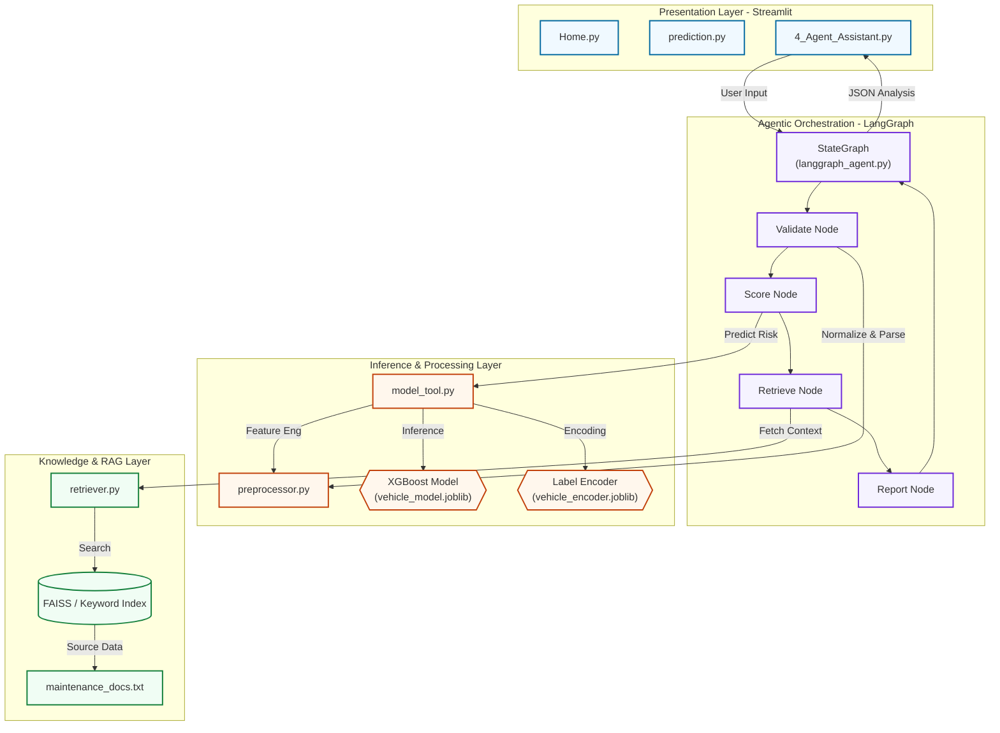

# 🏗️ System Architecture

This document provides the high-fidelity architecture diagram for the **Vehicle Maintenance Dashboard**. 

> [!NOTE]
> This diagram is provided as a pre-rendered image for immediate review and as a Mermaid source file for future editing.

## Architecture Diagram (Image)

---

## Downloads & Source

*   **Final Image**: [architecture_diagram.png](./assets/architecture_diagram.png)
*   **Mermaid Source**: [architecture_diagram.mmd](./assets/architecture_diagram.mmd)

---

## Git Compatibility & Rendering

To ensure the diagram is always visible when pushed to Git:
1.  **GitHub/GitLab**: The Mermaid block below will render dynamically.
2.  **Fallback**: If dynamic rendering is unavailable, the image above serves as the "Production-Ready" visualization.

### Mermaid Source (Dynamic Render)

## 🏗️ Layer Descriptions

*   **Presentation Layer**: Streamlit entry points and interactive dashboards.
*   **Agentic Orchestration**: LangGraph state machine directing the diagnostic workflow.
*   **Inference Layer**: XGBoost model and custom feature engineering logic.
*   **Knowledge Layer**: RAG-based context retrieval from vehicle manuals.
